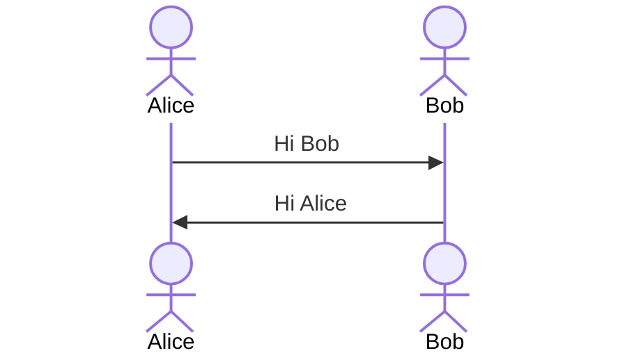

## Assignments for Java Boot Camp
* [Week 1 :: Design and Develop RESTful API with Spring Boot](https://github.com/up1/assignment-java-boot-camp/wiki/Week-01)

## Software Architecture

## Resources
* [Spring Boot Reference](https://spring.io/projects/spring-boot)
* https://www.baeldung.com/ 
* https://start.spring.io/
* [Git commit message](https://www.conventionalcommits.org/en/v1.0.0/)

